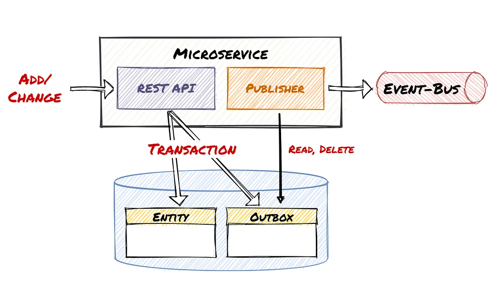

# Clean Architecture Study

Study on clean architecture based on micro-services and events queue.

This study has two main goals:

- provide an example of a clean architecture implementation, based on the Ports and Adapters pattern.
- provide an example of sharing data asynchronously between two services via a message broker like RabbitMq.

## Ports and Adapters architecture

This type of architecture is also known as [Hexagonal Architecture](https://codesoapbox.dev/ports-adapters-aka-hexagonal-architecture-explained/).

This study builds on top of this example [Hexagonal Architecture with Java and Spring](https://reflectoring.io/spring-hexagonal/).

Given the fact that this is a very simple example, it is understandable to ask why make such a complicated architecture for some simple CRUD services.

However, this is an example on how to start designing larger, more complex applications.

The main benefit of a clean architecture is that the domain business logic has no dependencies on the other modules. This allows for code that is easier to maintain and also migrate to other technologies or frameworks, or split into microservices,

## Event sourcing architecture

### Publish events via message broker

This type of architecture allows sharing data asynchronously between applications. This is done via events published on a message broker like RabbitMq. It is a publish-subscribe mechanism, where we have a producer and one or many consumers of the events.

Each time there is an update on the service that owns the data, an event is published via the message broker. All the application that listen to the topic or exchange for that event type will receive the message and update their copy of the data.

This kind of approach allows loose coupling between applications or services, which make them more resilient in case the other services are down for whatever reason.

However, it does come with the drawback of potentially stale data for a short duration of time. That is why this approach should be used with data that doesn't change very fast.

### The outbox pattern

This approach also implements the [Outbox Pattern](https://dzone.com/articles/implementing-the-outbox-pattern), which prevents the loss of events in case of communication problems with the queue.

The problem that this pattern is trying to solve is this: what happens if, after persisting data in your system, for whatever reason, the publishing of the event to the message broker fails? The answer is that all the systems that neeed this updated data will not receive it.

In order to prevent this, the events are instead stored in a database table called an outbox. The update on the resource and the creation of the event in the outbox take place in the same transaction.

Then, an asynchronous job reads the event from the outbox, publishes it in to the broker. If the publication is successful, then deletes it from the outbox.



## Idempotency

### Idempotent operations

We should always pay attention to the idempotency of our operations. An **idempotent operation** can be described as an operation that can be called multiple times without changing the result. Idempotence ensures that the same request leads to the same system state, and no action is unintentionally executed more than once.

For example, in REST services, `GET`, `UPDATE` and `DELETE` are naturally idempotent. No matter how many times we call them, the end result on the data is the same.

`POST` is not by default an idempotent operation, but in many situations it's a good idea to handle it like an idempotent operation in our systems.
For example, the first call to POST can create the resource, while subsequent calls can update it, just like `UPDATE`.
Ultimately, this decision should be informed by the business requirements.

Operation idempotence is especially important in event driven systems, where it can happen that events are sent or consumed multiple times.

It is important to note that several calls to an idempotent operation do not necessarily result in the same HTTP response.

`PUT`, for example, will return `201` (Created) if a resource is created, or `200` (OK) or `203` (No Content) if a resource was updated.

A `DELETE`, for example, can returns `200` (OK) or `204` (No Content) when an actual deletion takes place. Any subsequent calls will return `404` (Not found).

### Idempotency key

In order to make operations idempotent, it is required that the request or message has an **idempotency key**. This is a unique identifier, that the producer of the message is responsible for creating. It is usually a `UUID`, but it is a good idea to prefix the UUID with some human understandable information.

For example, an idempotency key for the exchange rate resource can be: `EXCH-RONEUR-3e4087be-9f16-4f76-a59a-9cc191bb3188`.

- `EXCH` - type of resource
- `RONEUR` - some basic information about the resource that can make it easier to identify it
- `3e4087be-9f16-4f76-a59a-9cc191bb3188` - the UUID.

In a an environment with a lot of message types exchanged between systems, a simple naming convention like this can make debugging much easier.

### References

- [What Is an Idempotent Operation?](https://www.baeldung.com/cs/idempotent-operations)
- [Idempotency in RESTful APIs and Event-Driven Systems](https://levelup.gitconnected.com/idempotency-in-restful-apis-and-event-driven-systems-43a26f91ea8d)
- [Pattern: Idempotent Consumer](https://microservices.io/patterns/communication-style/idempotent-consumer.html)


## Currency exchange service

Exposes endpoints for CRUD operations on exchange rates.

### Build

```shell
docker build --tag currency-exchange ./currency-exchange
docker-compose up
```

### Test

Run the shell script `test-endpoint-currency-exchange.sh`, or run the requests in the `postman` folder.

### Shutdown

```shell
docker-compose down --remove-orphans
``` 
